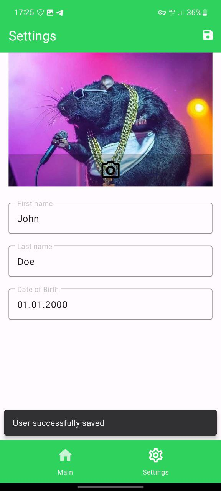

# Cryptocurrencies
App uses [coingecko API](https://www.coingecko.com/en/api/documentation) to retrieve a list of cryptocurrencies, sorted by selected order, displayed with pagination. Details screen contains price changes charts. User can set up profile including avatar, name and date of birth.

# Tech stack
- MVVM
- Clean architecture
- Android SDK
- Android View
- Retrofit
- OkHttp
- Room
- Koin
- Jetpack Navigation
- Glide
- Splash Screen API

# Usage
### Main Screen
 
### Details Screen
 
### Settings Screen
 